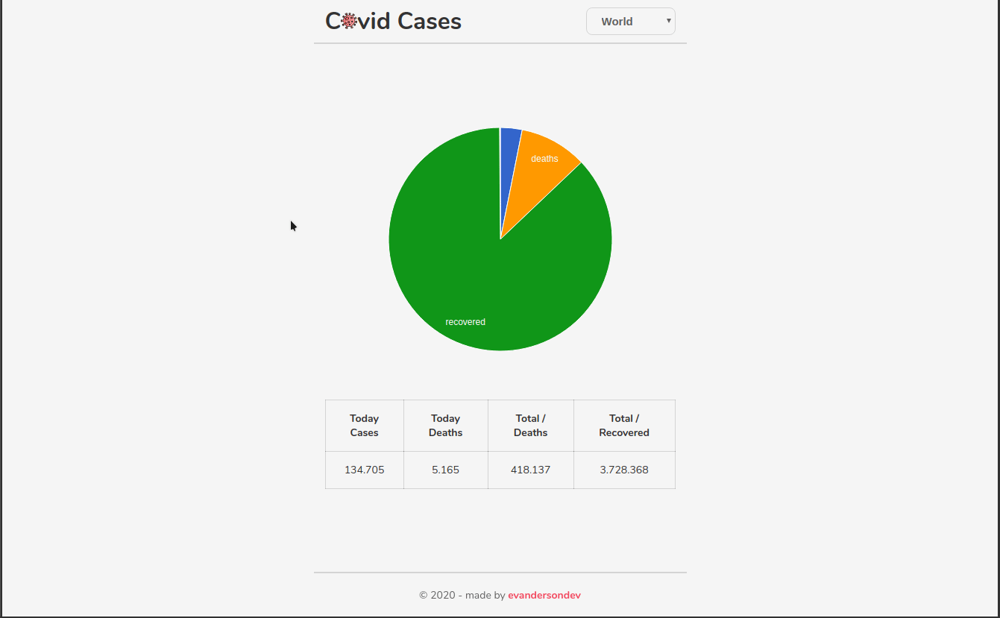
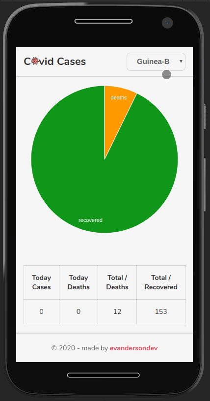

<h1 align="center">

Covid Cases 19

</h1>
<br>
<br>
  

  
<br>
<br>
<br>

<p align="center">Project for practice unit tests</p>

<p align="center">
  <a href="https://opensource.org/licenses/MIT">
    
  </a>
</p>

<hr />

### Getting started

- In your terminal, run the steps:

```
  git clone https://github.com/evandersondev/covid-cases covid-cases

  cd covid-cases

  yarn or npm install for install the modules

  yarn start or npm run start
```

```
You can access in your browser the web application http://localhost:3000
```

#### Online application at **<a href="https://covid-cases-19.netlify.app/" target="_blank">Covid Cases 19</a>**

## Features

[//]: # 'Add the features of your project here:'

Features used in the Project.

> **<a href="https://pt-br.reactjs.org/docs/getting-started.html" target="_blank">React Js</a>**

> **<a href="http://coronavirus-19-api.herokuapp.com/countries" target="_blank">API COVID</a>**

### - LICENSE

This project is licensed under the MIT License - see the <a href="https://opensource.org/licenses/MIT" target="_blank">LICENSE</a> page for details.
